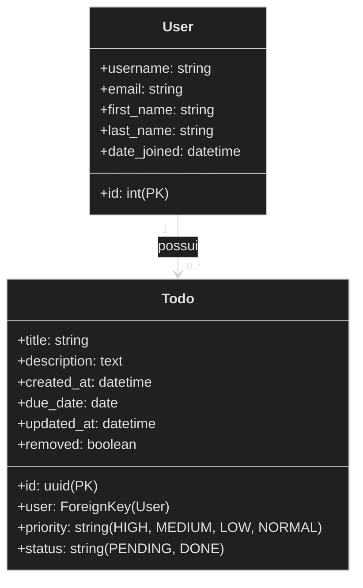

# Meus Afazeres 📝

Este projeto foi desenvolvido como parte da avaliação da disciplina de **Desenvolvimento Ágil com Ferramenta RAD** do **Instituto Federal da Paraíba (IFPB) - Campus João Pessoa**.

O objetivo do aplicativo é simular um quadro branco digital baseado em *post-its* coloridos, permitindo que usuários gerenciem suas tarefas diárias de maneira visual, ágil e intuitiva.

---

## 🎓 Contexto Acadêmico

*   **Instituição**: Instituto Federal da Paraíba (IFPB) - Campus João Pessoa
*   **Disciplina**: Desenvolvimento Ágil com Ferramenta RAD
*   **Professor**: Edemberg Rocha
*   **Equipe de Desenvolvimento**:
    *   Douglas Emerson Ferreira Carneiro — Matrícula: 20231370002
    *   Jonata Nascimento Barbosa — Matrícula: 20222370034
    *   Maira Larissa da Silva Fernandes — Matrícula: 20231370011

---

## 💡 Descrição do Problema e Solução

### O Problema
Muitas pessoas enfrentam dificuldades para organizar e acompanhar suas tarefas diárias, especialmente ao lidar com múltiplos prazos e níveis de prioridade. A ausência de uma ferramenta clara e visual pode causar atrasos, esquecimento e perda de produtividade.

### A Solução
O **Meus Afazeres** organiza as tarefas do usuário imitando post-its fixados em um quadro branco. A prioridade de cada tarefa é imediatamente identificável através de cores distintas de fundo nos cards.

---

## 🚀 Funcionalidades Implementadas

O projeto atende a todos os Requisitos Funcionais especificados na definição:

1.  **Gerenciamento de Afazeres (MVT & AJAX)**:
    *   **Criação** (RF1): Adição de tarefas com título, descrição, prioridade (Alta, Média, Leve, Normal) e data limite.
    *   **Edição** (RF2): Atualização dinâmica dos dados das tarefas.
    *   **Remoção** (RF3): Exclusão lógica (soft delete) por meio do atributo `removed`.
    *   *Nota*: As telas de criação, edição e confirmação de exclusão foram convertidas em **Modais AJAX** interativos sobrepostos na tela principal, eliminando recargas desnecessárias de página e melhorando a UX.
2.  **Toggle de Conclusão Rápida** (RF4):
    *   Botão liga/desliga nos cards para marcar/desmarcar tarefas como feitas instantaneamente.
3.  **Filtros Avançados e Busca** (RF5, RF6, RF7):
    *   Barra de busca por correspondência de título ou descrição.
    *   Filtros combinados de status (Feitos e Não Feitos) e prioridade (Alta, Média, Normal, Baixa).
    *   *Nota*: Filtros e busca são preservados corretamente durante a navegação das páginas.
4.  **Autenticação & Autorização** (RF8, RF9):
    *   Fluxos completos de cadastro e login, com feedback visual claro em caso de credenciais inválidas.
    *   Sincronização dos afazeres de acordo com o usuário autenticado.
    *   **Isolamento estrito por dono**: todas as queries de CRUD filtram `user=request.user`, impedindo que um usuário acesse dados de outro mesmo conhecendo o UUID da tarefa.
    *   **Painel Administrativo** (`/admin-dashboard/`): usuários com `is_staff=True` têm acesso a um dashboard global, protegido por `@staff_member_required`, que exibe cards de métricas (total de usuários, ativos na última semana, tarefas concluídas/pendentes), distribuição por prioridade e uma tabela paginada com todos os afazeres do sistema, incluindo os removidos (soft-deleted). O nome do dono é ofuscado na listagem para preservar a privacidade.
    *   🔴 **Vermelho** para prioridade Alta.
    *   🟠 **Laranja** para prioridade Média.
    *   🟡 **Amarelo** para prioridade Leve.
    *   ⚪ **Branco** para prioridade Normal.
6.  **Ordenação e Paginação** (RF11, RF12):
    *   Ordenação automática por data de criação (`-created_at`).
    *   Paginação dinâmica limitada a 25 itens por página na listagem principal.
7.  **Internacionalização (i18n)**:
    *   Suporte completo a três idiomas: **Português (pt-br)**, **Inglês (en)** e **Espanhol (es)**.
    *   O seletor de idiomas fica acessível no menu lateral (drawer) de perfil. O estado do menu persiste aberto mesmo após o recarregamento decorrente da alteração de idioma.
8.  **API REST integrada**:
    *   Exposição de endpoints para gerenciamento de afazeres e usuários por meio de REST API utilizando o Django REST Framework (DRF).

---

## 🔐 Autorização & RBAC

A aplicação implementa controle de acesso baseado em papéis usando a flag `is_staff` do Django como critério de autorização.

### Papéis do Sistema

| Papel | Flag Django | Permissões |
|---|---|---|
| **Usuário Comum** | `is_staff=False` | CRUD dos próprios afazeres. Sem visibilidade de dados de outros usuários. |
| **Administrador** | `is_staff=True` | Acesso ao Painel Administrativo. Leitura global de todos os afazeres e métricas. |

### Proteção das Views

*   **Views de usuário comum**: decoradas com `@login_required`. Todas as queries filtram `user=request.user`, impedindo acesso aos dados de outro usuário mesmo conhecendo o UUID da tarefa.
*   **Views administrativas**: decoradas com `@staff_required`, que redireciona para o login caso o usuário não tenha a flag `is_staff`.
*   **Feedback de credenciais inválidas**: a tela de login exibe uma mensagem de erro clara quando as credenciais não correspondem a nenhuma conta.

---

## 🖥️ Painel Administrativo

Acessível em `/dashboard/` (apenas para `is_staff=True`), o painel oferece uma visão consolidada do sistema sem expor dados pessoais sensíveis.

### Funcionalidades do Painel

| Seção | Descrição |
|---|---|
| **Cards de Métricas** | Total de usuários cadastrados, usuários ativos nos últimos 7 dias, total de tarefas, concluídas e pendentes. |
| **Distribuição por Prioridade** | Contagem de afazeres por nível de prioridade (Alta, Média, Leve, Normal). |
| **Lista Global de Afazeres** | Tabela paginada (25/página) com todos os afazeres do banco, incluindo os removidos (soft-deleted). O nome do dono é ofuscado (apenas as 2 primeiras letras + `•••••`) para preservar a privacidade. |

### Criando um Usuário Administrador

```bash
# Cria superusuário interativamente
python manage.py createsuperuser

# Ou promovendo um usuário existente via shell
python manage.py shell -c "
from django.contrib.auth.models import User
u = User.objects.get(username='seu_usuario')
u.is_staff = True
u.save()
"
```

---

## 🛠️ Stack Tecnológica

*   **Backend**: Python 3.12+ & Django 3.0+
*   **REST API**: Django REST Framework (DRF)
*   **Banco de Dados**: SQLite (db.sqlite3)
*   **Design & UI**: Vanilla CSS & Tailwind CSS
*   **JavaScript**: Vanilla JS (AJAX via Fetch API, controle do Drawer de Perfil e Modais)
*   **Internacionalização**: Django i18n & Gettext compilation

---

## 📐 Esquema do Banco de Dados (Modelagem)



---

## ⚙️ Instalação e Execução

### 1. Clonar o repositório e entrar no diretório
```bash
git clone <url-do-repositorio>
cd rad-todo-app
```

### 2. Ativar o Ambiente Virtual (venv)
```bash
source venv/bin/activate
```

### 3. Instalar dependências
```bash
pip install -r requirements.txt
```

### 4. Executar Migrações do Banco de Dados
```bash
python manage.py migrate
```

### 5. Compilar os arquivos de Tradução (i18n)
```bash
python manage.py compilemessages
```

### 6. Iniciar o servidor de desenvolvimento
```bash
python manage.py runserver
```
Acesse a aplicação pelo navegador em: `http://127.0.0.1:8000/`.

---

## 🧪 Executando os Testes Automatizados

O projeto conta com uma suíte de **17 testes** automatizados que validam a integridade dos modelos, das views do Django (MVT), controle de autenticação, e das operações da API REST (incluindo segurança, validações de formato de dados e paginação).

Para executar os testes:
```bash
python manage.py test
```
